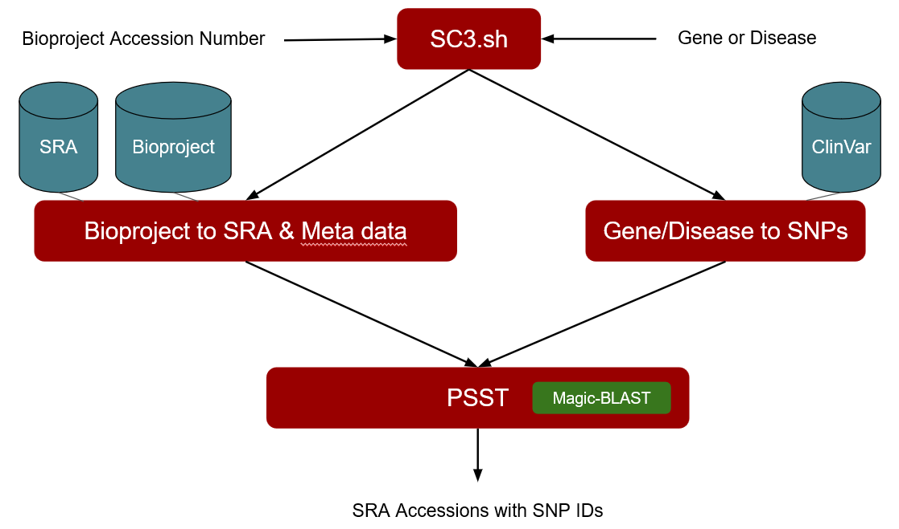

# (SC)<sup>3</sup> Super Concise Single Cell Snp Caller!

## Call Gene Specific Pathogenic SNPs on the Fly!

This project enables finding expressed SNPs in SRA data associated with a Bioproject record.

### SC3 pipeline



### Functionality

From a set of patients you can observe gene- or disease-specific variant expression in an individual in a cell-type specific manner.  


### Usage

```Just input a (gene name OR disease of interest) AND an NCBI BioProject number!```

### Results

```Example: SNPs expressed in different cell types within a tissue```

### Implementation

*prototype.sh collects relevent SNP RSids from ClinVar. This script takes 3 arguments; the clinvar database in gzipped vcf format, a relavant GENEid or Disease name, and the Clinical significance cutoff. Currently the clinical significance cutoff is either 5 for pathogenic, or all SNPs related to the disease regardless of pathogenicity. Also of note, in most cases, Disease names with spaces are often coded in the clinvar vcf file as underscores "_". It may be preferable to search a partial name of the Disease rather than the complete name. The output of this program will be a list of RSids that will be used in the next step.

*a script extracts all SRRs from a given BioProject, and uses ArrayExpressed to check for good datasets

*The list of SRAs and RS nimbers are then combined using the [PSST](https://github.com/NCBI-Hackathons/PSST) package from a previous NCBI Hackathon. <Jake Write this section> 

*Cell-specific SNP information is analyzed with R <info here, example below>

### Confounding Factors
- Identifying SRA records that are cell-lines or cancer samples
- Dealing with non-expressed alleles by using missing values
- Treating homozygosity & heterozygosity intelligently


### Future Directions

*A shiny app that allows researchers to select cell type and individual patients as well as gene- or disease-specific variants and look for individual level differences.  
*Then provide the SNP matrix for that specific patient in that particular cell as a dataframe.  
